# Java Web/Eclipse/Maven/Tomcat

最近有个新项目是java web项目，记录一下，可能比较乱。虽然没接触过Java，但是eclipse还是用过的

## 初识项目

同事说，项目是maven打包的，可以用maven开启服务，我就研究了一下，由于项目不能外露，我先创建一个demo的项目。

### 用eclipse 创建 Maven web项目

- 打开eclipse **File->New->Maven Project**。如果默认列表中没有Maven Project 选择 **Other...**

- 如下图，什么不用选择，直接Next

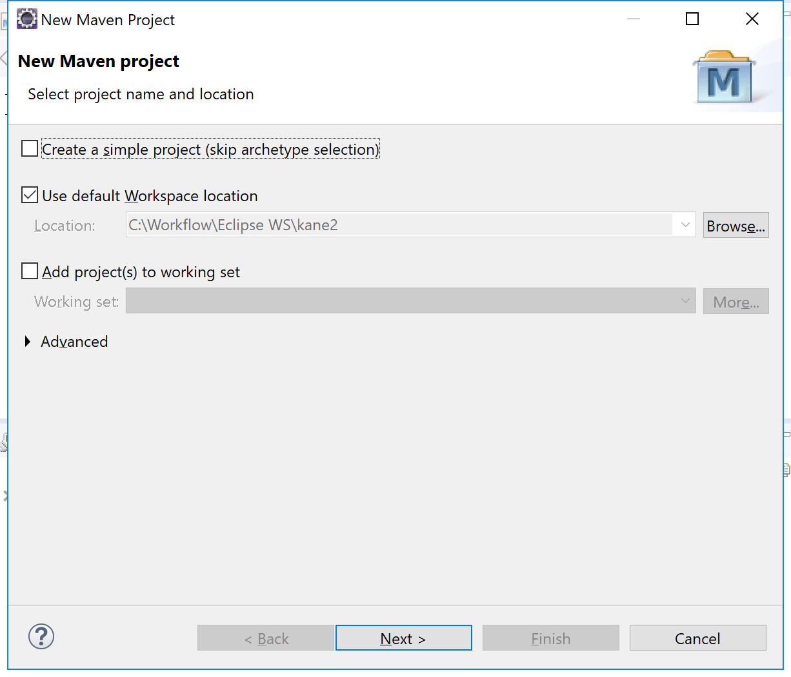

- 如下图，请选择 **maven-archetype-webapp**，因为我们要创建一个web项目

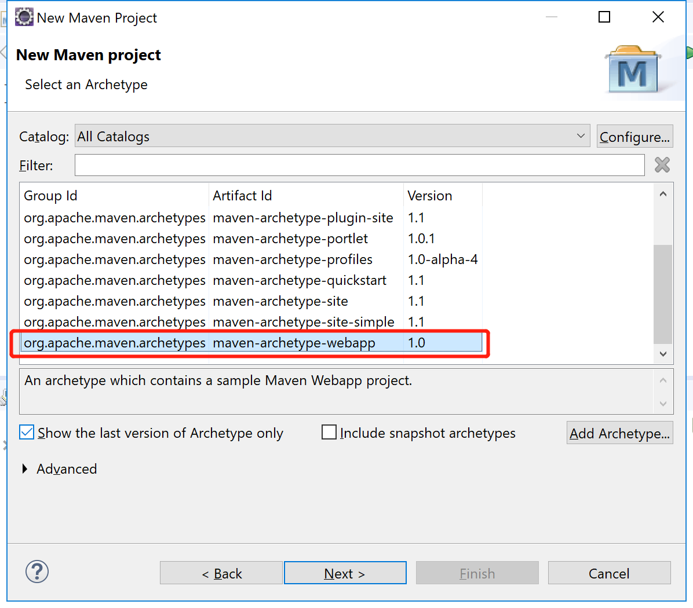

- 如下图输入 group id 与 artifact id 点击finish即可

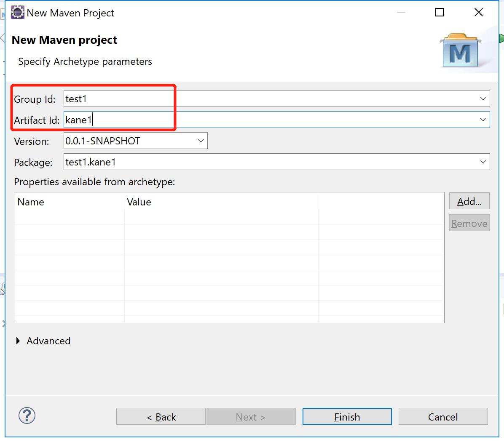

- 下面配置一个Tomcat Apache 服务器
  - 访问 [tomcat 官网](https://tomcat.apache.org/download-70.cgi)下载压缩包，并解压。
  - 在 eclipse中依次打开 **Window->Preferences**
  - 如图一次找到 **Server->Runtime Environments** 点击子面板上的 Add 按钮

  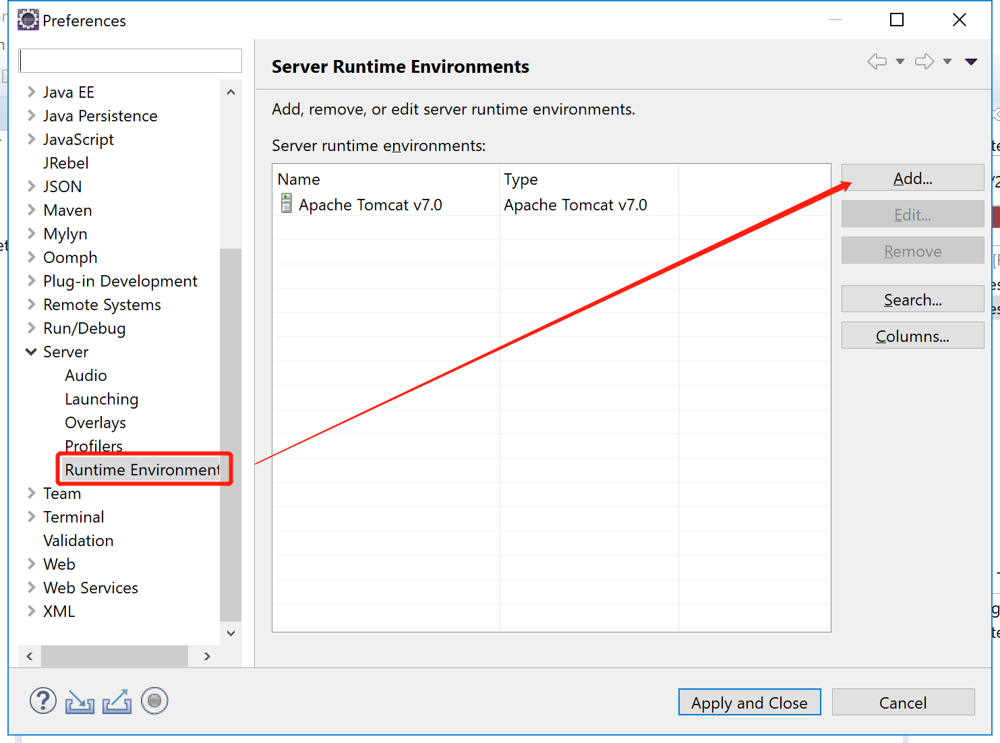

  - 选择你自己的下载的tomcat 版本，我下载的是7，点击Next

  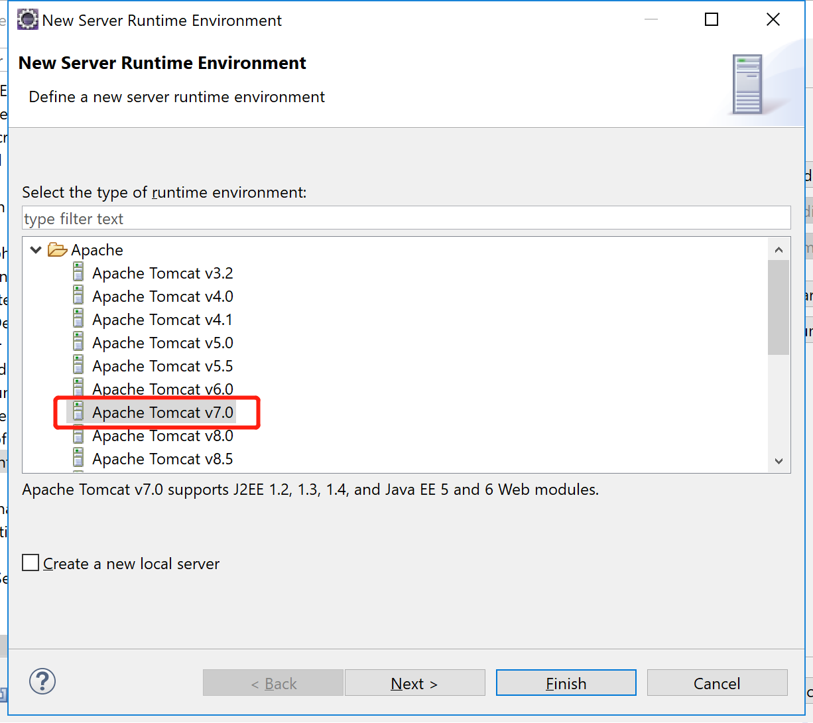

  - 找到刚才解压好的Tomcat路径，点击finish

  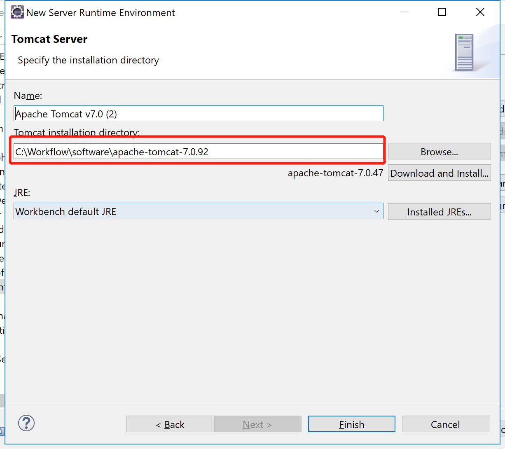
- 下面直接将，刚才的Maven项目放到 Tomcat中运行。
  - 项目上右键依次 **Run As-> Run on Server**，选择刚才添加的Tomcat，

  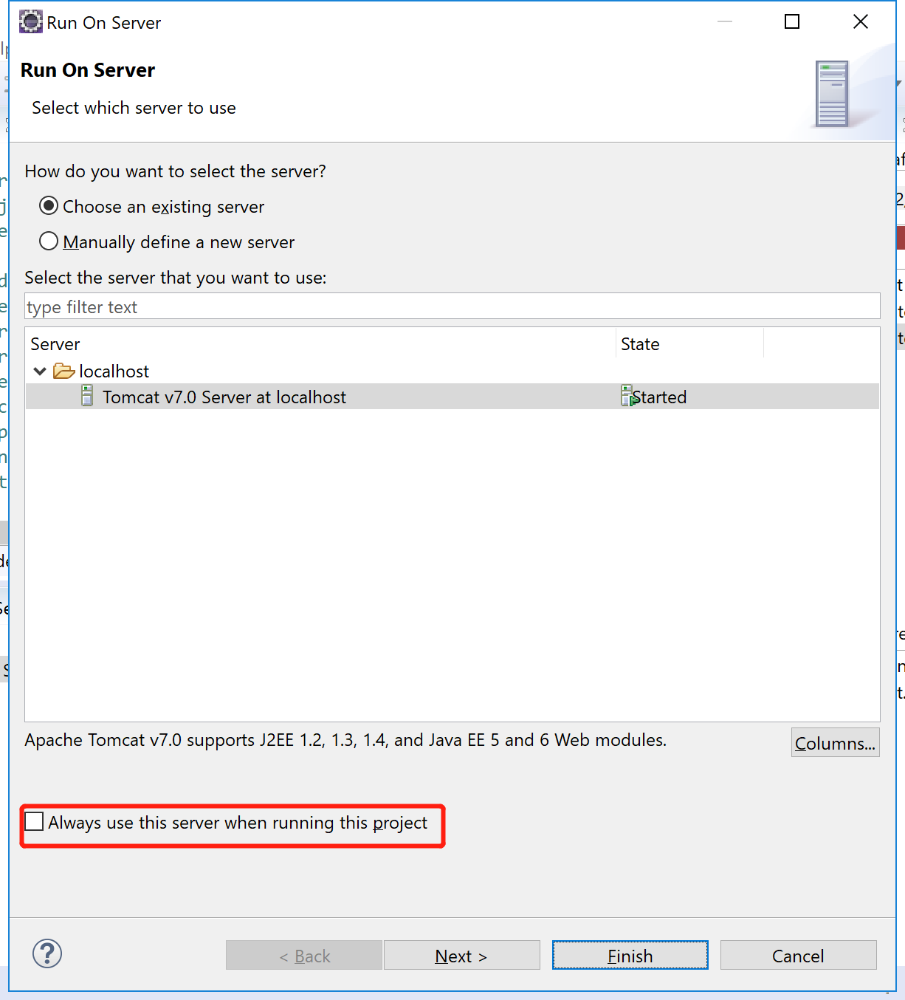

  - 上图，成功开启WebApp

  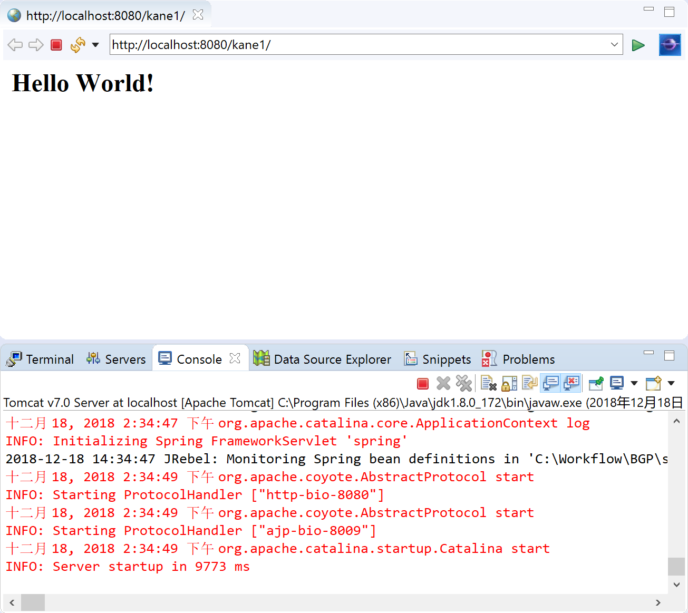

## 使用Maven自己创建Web项目

下面介绍如何用CMD，自己用maven 命令行创建web项目

- [到maven官网下载 maven](https://maven.apache.org/download.cgi)，下载后解压
- 到环境变量去配置 maven 命令，将 **[your maven path]/bin**配置到path中
- 随意打开一个CMD 键入 **mvn --version**

```CMD
# 打出版本信息
Apache Maven 3.6.0 (97c98ec64a1fdfee7767ce5ffb20918da4f719f3; 2018-10-25T02:41:47+08:00)
Maven home: C:\Workflow\apache-maven-3.6.0\bin\..
Java version: 1.8.0_172, vendor: Oracle Corporation, runtime: C:\Program Files (x86)\Java\jdk1.8.0_172\jre
Default locale: en_US, platform encoding: GBK
OS name: "windows 10", version: "10.0", arch: "x86", family: "windows"
```

- CD 到你想要创建项目的目录下，键入如下命令：

```CMD
mvn archetype:generate # 创建
    -DgroupId=packageName # 相当于 eclipse里面的groupid
    -DartifactId=webappName # 相当于 eclipse里面的artifactid
    -DarchetypeArtifactId=maven-archetype-webapp #相当于在eclipse中选择maven-archetype-webapp
# 命令请弄成一行，执行
mvn archetype:generate -DgroupId=packageName -DartifactId=webappName -DarchetypeArtifactId=maven-archetype-webapp 
#这里说明一下，在之前的maven版本使用create，在3.0.5版本之后使用generate替代create了
```

```CMD
#贴一下成功的结果
[INFO] Scanning for projects...
[INFO]
[INFO] ------------------< org.apache.maven:standalone-pom >-------------------
[INFO] Building Maven Stub Project (No POM) 1
[INFO] --------------------------------[ pom ]---------------------------------
[INFO]
[INFO] >>> maven-archetype-plugin:3.0.1:generate (default-cli) > generate-sources @ standalone-pom >>>
[INFO]
[INFO] <<< maven-archetype-plugin:3.0.1:generate (default-cli) < generate-sources @ standalone-pom <<<
[INFO]
[INFO]
[INFO] --- maven-archetype-plugin:3.0.1:generate (default-cli) @ standalone-pom ---
[INFO] Generating project in Interactive mode
Downloading from central: https://repo.maven.apache.org/maven2/org/apache/maven/archetypes/maven-archetype-bundles/2/maven-archetype-bundles-2.pom
Downloaded from central: https://repo.maven.apache.org/maven2/org/apache/maven/archetypes/maven-archetype-bundles/2/maven-archetype-bundles-2.pom (1.5 kB at 2.2 kB/s)
Downloading from central: https://repo.maven.apache.org/maven2/org/apache/maven/archetype/maven-archetype-parent/1/maven-archetype-parent-1.pom
Downloaded from central: https://repo.maven.apache.org/maven2/org/apache/maven/archetype/maven-archetype-parent/1/maven-archetype-parent-1.pom (1.3 kB at 1.9 kB/s)
Downloading from central: https://repo.maven.apache.org/maven2/org/apache/maven/maven-parent/4/maven-parent-4.pom
Downloaded from central: https://repo.maven.apache.org/maven2/org/apache/maven/maven-parent/4/maven-parent-4.pom (10.0 kB at 15 kB/s)
[INFO] Using property: groupId = packageName
[INFO] Using property: artifactId = webappName
Define value for property 'version' 1.0-SNAPSHOT: : test
[INFO] Using property: package = packageName
Confirm properties configuration:
groupId: packageName
artifactId: webappName
version: test
package: packageName
 Y: :
[INFO] ----------------------------------------------------------------------------
[INFO] Using following parameters for creating project from Old (1.x) Archetype: maven-archetype-webapp:1.0
[INFO] ----------------------------------------------------------------------------
[INFO] Parameter: basedir, Value: C:\Workflow\Eclipse WS
[INFO] Parameter: package, Value: packageName
[INFO] Parameter: groupId, Value: packageName
[INFO] Parameter: artifactId, Value: webappName
[INFO] Parameter: packageName, Value: packageName
[INFO] Parameter: version, Value: test
[INFO] project created from Old (1.x) Archetype in dir: C:\Workflow\Eclipse WS\webappName
[INFO] ------------------------------------------------------------------------
[INFO] BUILD SUCCESS
[INFO] ------------------------------------------------------------------------
[INFO] Total time:  43.033 s
[INFO] Finished at: 2018-12-18T14:48:42+08:00
[INFO] ------------------------------------------------------------------------
```

- 直接键入 **mvn tomcat:run**，经过maven一顿自动下载之后，会开启tomcat

```CMD
C:\Workflow\Eclipse WS\webappName>mvn tomcat:run
[INFO] Scanning for projects...
[INFO]
[INFO] -----------------------< packageName:webappName >-----------------------
[INFO] Building webappName Maven Webapp test
[INFO] --------------------------------[ war ]---------------------------------
[INFO]
[INFO] >>> tomcat-maven-plugin:1.1:run (default-cli) > compile @ webappName >>>
[INFO]
[INFO] --- maven-resources-plugin:2.6:resources (default-resources) @ webappName ---
[WARNING] Using platform encoding (GBK actually) to copy filtered resources, i.e. build is platform dependent!
[INFO] Copying 0 resource
[INFO]
[INFO] --- maven-compiler-plugin:3.1:compile (default-compile) @ webappName ---
[INFO] No sources to compile
[INFO]
[INFO] <<< tomcat-maven-plugin:1.1:run (default-cli) < compile @ webappName <<<
[INFO]
[INFO]
[INFO] --- tomcat-maven-plugin:1.1:run (default-cli) @ webappName ---
[INFO] Running war on http://localhost:8080/webappName
[INFO] Using existing Tomcat server configuration at C:\Workflow\Eclipse WS\webappName\target\tomcat
十二月 18, 2018 3:07:41 下午 org.apache.catalina.startup.Embedded start
INFO: Starting tomcat server
十二月 18, 2018 3:07:41 下午 org.apache.catalina.core.StandardEngine start
INFO: Starting Servlet Engine: Apache Tomcat/6.0.29
十二月 18, 2018 3:07:41 下午 org.apache.coyote.http11.Http11Protocol init
INFO: Initializing Coyote HTTP/1.1 on http-8080
十二月 18, 2018 3:07:41 下午 org.apache.coyote.http11.Http11Protocol start
INFO: Starting Coyote HTTP/1.1 on http-8080
```

- 浏览器 访问上面提供的网址，发现报错了。如下图

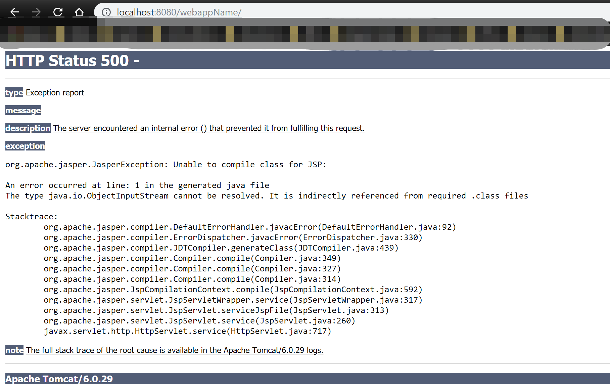

- 调查之后发现是tomcat的版本与jdk版本不符合，我的本地是1.8这样我们需要tomcat7来运行，上面eclipse安装的恰好还是7
- 打开项目目录下的pom.xml文件，在build标签下增加如下内容

```xml
<plugins>
	<plugin>
		<groupId>org.apache.tomcat.maven</groupId>
			<artifactId>tomcat7-maven-plugin</artifactId> 
			<version>2.2</version>
			<configuration>
					<port>8080</port>
					<uriEncoding>UTF-8</uriEncoding>
					<url>http://localhost:8080</url>
					<server>tomcat7</server>
			</configuration>
	</plugin>
</plugins>
```

- 重新键入命令 **mvn tomcat7:run**，经过一顿下载之后开启tomcat7

```cmd
C:\Workflow\Eclipse WS\webappName>mvn tomcat7:run
[INFO] Scanning for projects...
[INFO]
[INFO] -----------------------< packageName:webappName >-----------------------
[INFO] Building webappName Maven Webapp test
[INFO] --------------------------------[ war ]---------------------------------
[INFO]
[INFO] >>> tomcat7-maven-plugin:2.2:run (default-cli) > process-classes @ webappName >>>
[INFO]
[INFO] --- maven-resources-plugin:2.6:resources (default-resources) @ webappName ---
[WARNING] Using platform encoding (GBK actually) to copy filtered resources, i.e. build is platform dependent!
[INFO] Copying 0 resource
[INFO]
[INFO] --- maven-compiler-plugin:3.1:compile (default-compile) @ webappName ---
[INFO] No sources to compile
[INFO]
[INFO] <<< tomcat7-maven-plugin:2.2:run (default-cli) < process-classes @ webappName <<<
[INFO]
[INFO]
[INFO] --- tomcat7-maven-plugin:2.2:run (default-cli) @ webappName ---
[INFO] Running war on http://localhost:8080/webappName
[INFO] Using existing Tomcat server configuration at C:\Workflow\Eclipse WS\webappName\target\tomcat
[INFO] create webapp with contextPath: /webappName
十二月 18, 2018 3:26:14 下午 org.apache.coyote.AbstractProtocol init
INFO: Initializing ProtocolHandler ["http-bio-8080"]
十二月 18, 2018 3:26:14 下午 org.apache.catalina.core.StandardService startInternal
INFO: Starting service Tomcat
十二月 18, 2018 3:26:14 下午 org.apache.catalina.core.StandardEngine startInternal
INFO: Starting Servlet Engine: Apache Tomcat/7.0.47
十二月 18, 2018 3:26:16 下午 org.apache.coyote.AbstractProtocol start
INFO: Starting ProtocolHandler ["http-bio-8080"]
```

- 访问浏览器，发现可以正常显示Hello World

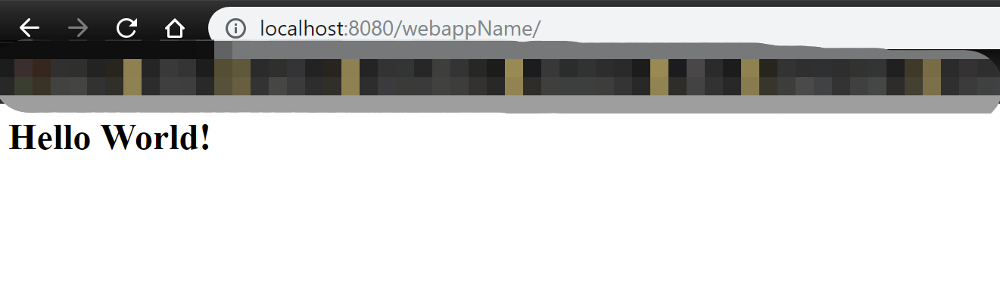

- 至此，使用maven 创建了一个web项目并运行起来

## 使用jetty运行Maven 项目

给我项目中，我是用jetty起来的，没有使用tomcat，介绍下jetty的使用方法

- 接着上面的项目来，我们直接更改pom.xml文件，放到<plugins>中

```xml
<plugin>
		<groupId>org.mortbay.jetty</groupId>
		<artifactId>maven-jetty-plugin</artifactId>
		<version>6.1.5</version>
		<configuration>
				<webAppSourceDirectory>src/main/webapp</webAppSourceDirectory>
				<scanIntervalSeconds>0</scanIntervalSeconds><!--这个是jetty支持的java热部署，但是不建议使用-->
				<contextPath>/webappName</contextPath>
				<connectors>
						<connector implementation="org.mortbay.jetty.nio.SelectChannelConnector">
								<port>8080</port>
						</connector>
				</connectors>
		</configuration>
</plugin>
```

- 关闭刚才开启的tomcat，键入 **mvn jetty:run**

```cmd
# maven 一顿安装之后，输出如下，
[INFO] Configuring Jetty for project: webappName Maven Webapp
[INFO] Webapp source directory = C:\Workflow\Eclipse WS\webappName\src\main\webapp
[INFO] web.xml file = C:\Workflow\Eclipse WS\webappName\src\main\webapp\WEB-INF\web.xml
[INFO] Classes = C:\Workflow\Eclipse WS\webappName\target\classes
[INFO] Logging to org.slf4j.impl.MavenSimpleLogger(org.mortbay.log) via org.mortbay.log.Slf4jLog
[INFO] Context path = /webappName
[INFO] Tmp directory = C:\Workflow\Eclipse WS\webappName\target\work
[INFO] Web defaults =  jetty default
[INFO] Web overrides =  none
[INFO] Webapp directory = C:\Workflow\Eclipse WS\webappName\src\main\webapp
[INFO] Starting jetty 6.1.5 ...
[INFO] jetty-6.1.5
[INFO] No Transaction manager found - if your webapp requires one, please configure one.
[INFO] Started SelectChannelConnector@0.0.0.0:8080
[INFO] Started Jetty Server
```

- 打开浏览器，重新输入localhost:8080，还是能够正常访问Hello World

## 在 eclipse中，使用maven build web项目

Eclipse中当然也可以使用上面的maven 命令进行项目build

- 打开Eclipse，将上面使用maven的项目Import到eclipse 工作目录中。一次选择 **File->Import->**，找到 **Maven -> Existing Maven Project**
- 打开项目后，在导入的项目上右键，依次找到 **Run as -> Maven build...**先配置下maven执行的命令，要选择带三个点的呦。
- 做如下的配置，

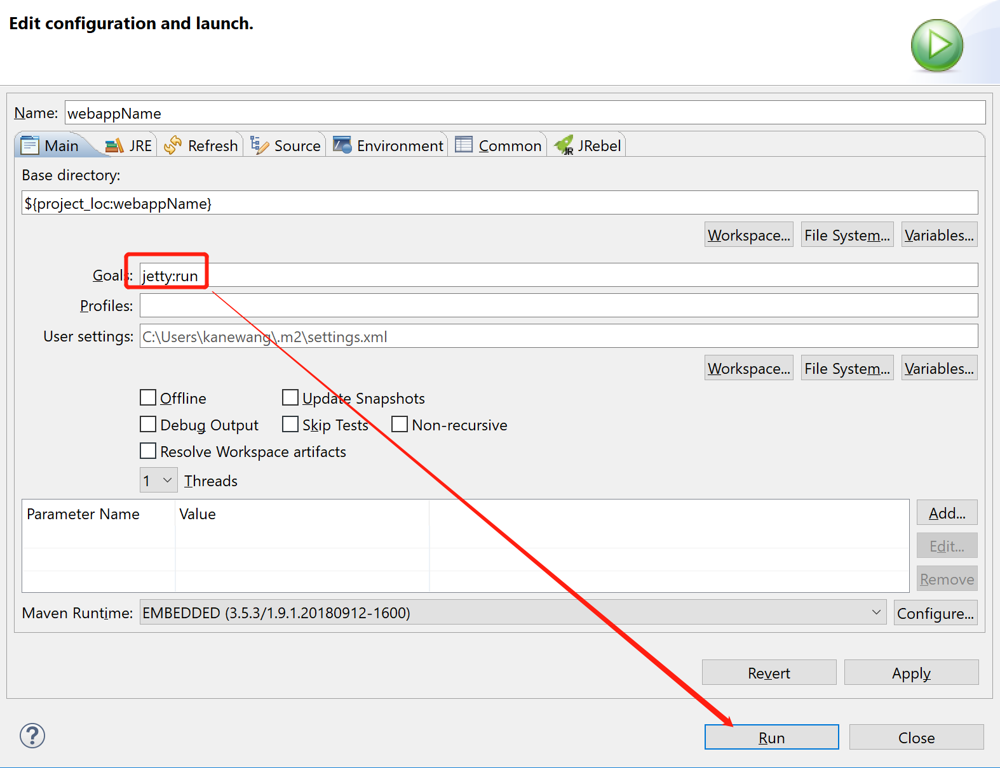

- console输出

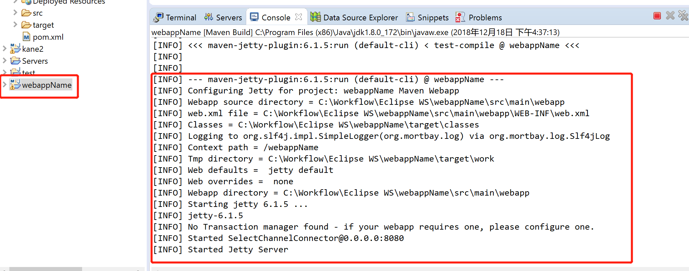

- 增加另一个配置，配置 tomcat7:run
- 访问浏览器会发现都可以访问Hello World

## Eclipse的Java 热部署

改个java 代码就需要重新开服务器感觉太耽误效率了。最后了解到有一个叫Jrebel的插件，下面介绍一下

- 依次点击 **Help -> Eclipse Marketplace**搜索 Jrebel 插件，依次安装上，重启Eclipse。

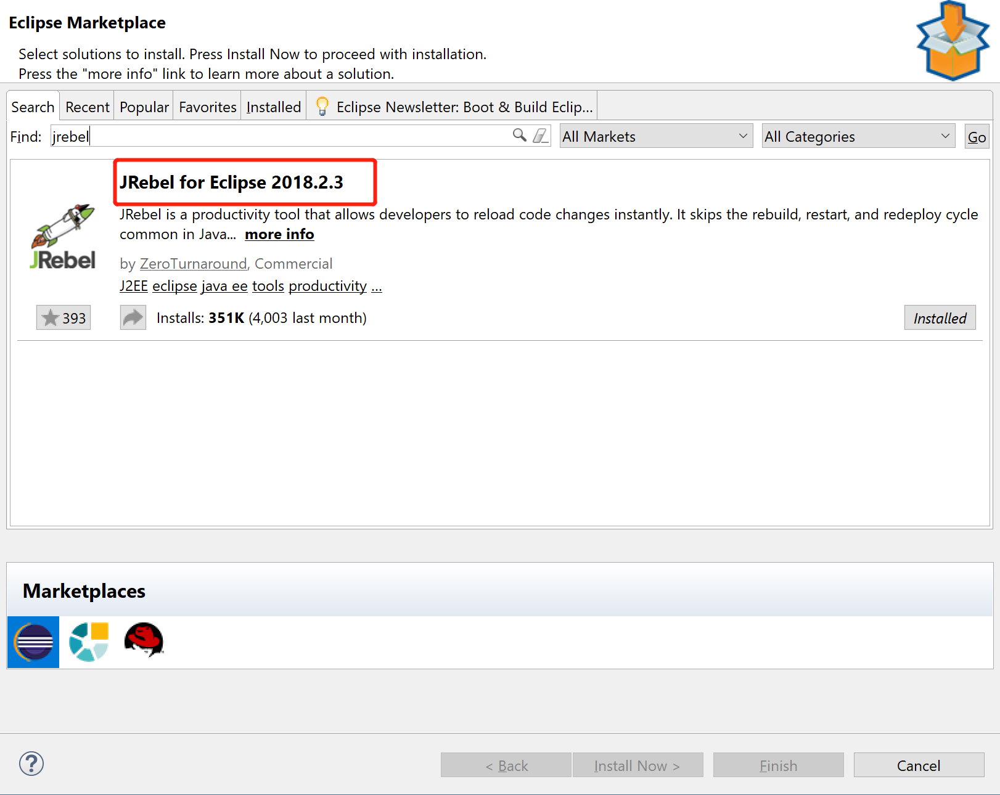

- 插件需要激活，这边可以申请免费的有14天的免费试用时长。直接到[官网](http://10.124.207.249/)注册一个账号就可以了。将license copy下来
- 依次打开 **Help->JRebel->Configuration**配置lincense，免费的话选择第三个Activation Code，将刚才注册账号时给的code复制进来就可以。在这里推荐一个永久免费的，是我在网上找到的一个server：http://139.199.89.239:1008/，邮箱随便输入就好了。

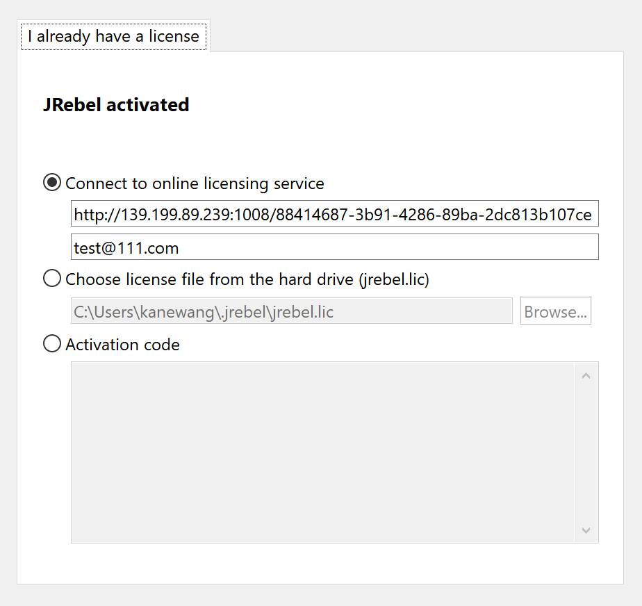

- 由于我们在Eclipse里面配置的，所以想要使用，Jrebel必须 Run on server使用Eclipse中的 tomcat
- 在你的Tomcat启动之前在Console里面看到如下输出，证明你成功了：

```
2018-12-18 17:14:49 JRebel:  Starting logging to file: C:\Users\kanewang\.jrebel\jrebel.log
2018-12-18 17:14:49 JRebel:  
2018-12-18 17:14:49 JRebel:  #############################################################
2018-12-18 17:14:49 JRebel:  
2018-12-18 17:14:49 JRebel:  JRebel Agent 2018.2.3 (201811261141)
2018-12-18 17:14:49 JRebel:  (c) Copyright ZeroTurnaround AS, Estonia, Tartu.
2018-12-18 17:14:49 JRebel:  
2018-12-18 17:14:49 JRebel:  Over the last 2 days JRebel prevented
2018-12-18 17:14:49 JRebel:  at least 8 redeploys/restarts saving you about 0.3 hours.
2018-12-18 17:14:49 JRebel:  
2018-12-18 17:14:49 JRebel:  License acquired from License Server: http://139.199.89.239:1008
2018-12-18 17:14:49 JRebel:  
2018-12-18 17:14:49 JRebel:  Licensed to kanewang.
2018-12-18 17:14:49 JRebel:  
2018-12-18 17:14:49 JRebel:  
2018-12-18 17:14:49 JRebel:  #############################################################
2018-12-18 17:14:49 JRebel:  
```

- 我们改一个java代码

  - 这里会发现创建的maven项目中没有java代码，我们接下来介绍下，如何使用spring框架
  - 我们首先在main文件夹下创建一个目录java
  - 然后再java文件夹下床建一个package，找不到package选择 **other**搜索一下 package，我的包叫kane1
  - 在kane1包下创建文件test1Controller.java，这个controller目前还不能被web访问到。
  - 在 **main/webapp/WEB_INF**下创建一个xml，名字随意，我的是spring-servlet.xml，并写入如下内容

  ```xml
  <?xml version="1.0" encoding="UTF-8"?> 
  <beans xmlns="http://www.springframework.org/schema/beans"
      xmlns:xsi="http://www.w3.org/2001/XMLSchema-instance"
      xmlns:p="http://www.springframework.org/schema/p"
      xmlns:context="http://www.springframework.org/schema/context"
      xmlns:mvc="http://www.springframework.org/schema/mvc"
      xsi:schemaLocation="http://www.springframework.org/schema/beans 
          http://www.springframework.org/schema/beans/spring-beans-3.0.xsd 
          http://www.springframework.org/schema/context 
          http://www.springframework.org/schema/context/spring-context-3.0.xsd
          http://www.springframework.org/schema/mvc 
  		http://www.springframework.org/schema/mvc/spring-mvc-3.0.xsd"> 
    	<mvc:default-servlet-handler/>
    	<!-- Activates scanning of @Controller -->
    	<!-- 
    		这里是你刚才定义的包位置，我只有一层
    		这里是告诉spring kane1包下带@Controller annotation的方法都有映射到servlet里面去
    	-->
      <context:component-scan base-package="kane1" />         
  	<mvc:annotation-driven/>   
  </beans>
  ```

  - 下面更改pom.xml文件，增加两个包的依赖。

  ```xml
  	<dependency>
          <groupId>javax.servlet</groupId>
          <artifactId>javax.servlet-api</artifactId>
          <version>3.0.1</version>
          <scope>provided</scope>
  	</dependency>
      <dependency>
          <groupId>org.springframework</groupId>
          <artifactId>spring-webmvc</artifactId>
          <version>4.0.3.RELEASE</version>
      </dependency>
  ```

  - 然后修改test1Controller.java，代码如下

  ```java
  package kane1;
  import javax.servlet.http.HttpServletRequest;
  import javax.servlet.http.HttpServletResponse;
  import org.springframework.stereotype.Controller;
  import org.springframework.web.bind.annotation.RequestMapping;
  import org.springframework.web.bind.annotation.RequestMethod;
  import org.springframework.web.bind.annotation.ResponseBody;
  @Controller
  public class test1Controller {
  	@RequestMapping(value = "test", method = RequestMethod.GET)//定义方法与url的映射关系
  	public @ResponseBody String test(HttpServletRequest request,HttpServletResponse response) {
  		return "This is test1 controller's test function";
  	}
  }
  ```

  - 重新启动服务器，在url中输入 **http://localhost:8080/kane1/test**，上图：

  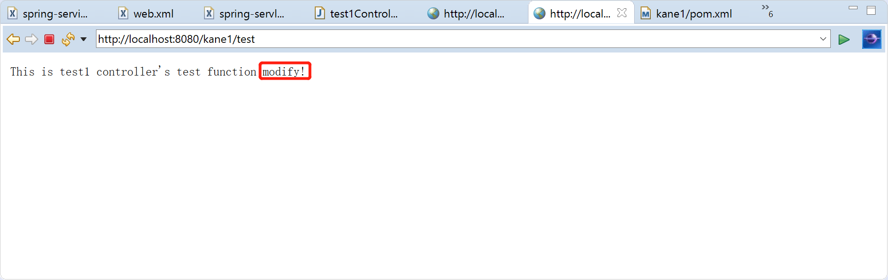

  - 我们这个时候更改一下test1.Controller.java，将输出更改为 **"This is test1 controller's test function modify!"**，在console里面看到如下提示证明JRebel成功在检测java代码的变化

  ```
  2018-12-19 10:01:06 JRebel: Reloading class 'kane1.test1Controller'.
  ```

  - 我们不重启tomcat，直接刷新刚才的页面，上图：发现热部署成功了。

  

  - 最后再上一个，自动部署的截图吧

  


## 命令行中使用JRebel 热部署

Jrebel 本身支持很多种使用方式，下面我们再尝试一下，自己在使用命令行，如何进行热部署的配置。

- 到官网下载软件的压缩包，[官网](https://zeroturnaround.com/software/jrebel/download/prev-releases/)，然后解压。上一下目录结构

```cmd
│  3rd-party-licenses-jrebel.txt
│  Changelog.txt
│  jrebel.ico
│  jrebel.jar
│  jrebel.png
│  License.txt
│  readme.txt
│  ZeroTurnaround.url
│
├─bin
│      activate-gui.cmd
│      activate-gui.sh
│      activate.cmd
│      activate.sh
│      go-offline.cmd
│      go-offline.sh
│      jrebel-activation.jar
│
└─lib
        jrebel32.dll
        jrebel64.dll
        libjrebel32.dylib
        libjrebel32.so
        libjrebel64.dylib
        libjrebel64.so
#我们直接使用lib下的文件，bin下的文件是登录激活使用的，因为在Eclipse里面已经激活了，是不需要再次激活的
```

- 在 cmd中打开项目目录，键入如下命令，这次我们以jetty开启web 服务

```cmd
set MAVEN_OPTS=-agentpath:[your extract path]\lib\jrebel32.dll
# 设置环境变量，后面是32还是64看你的jdk位数，错了会提醒你的
```

- 确保一件事情，打开pom.xml，保证jetty的自动部署时间scanIntervalSeconds是0，也就是关闭掉

```xml
<plugin>
 <groupId>org.eclipse.jetty</groupId>
 <artifactId>jetty-maven-plugin</artifactId>
 <configuration>
   <scanIntervalSeconds>0</scanIntervalSeconds>
 </configuration>
</plugin>
```

- CMD中键入 mvn jetty:run开启服务：

```cmd
#看到如下输出，就证明成功了
2018-12-19 10:20:49 JRebel:  Starting logging to file: C:\Users\kanewang\.jrebel\jrebel.log
2018-12-19 10:20:49 JRebel:
2018-12-19 10:20:50 JRebel:  #############################################################
2018-12-19 10:20:50 JRebel:
2018-12-19 10:20:50 JRebel:  JRebel Agent 2018.2.3 (201811261141)
2018-12-19 10:20:50 JRebel:  (c) Copyright ZeroTurnaround AS, Estonia, Tartu.
2018-12-19 10:20:50 JRebel:
2018-12-19 10:20:50 JRebel:  Over the last 2 days JRebel prevented
2018-12-19 10:20:50 JRebel:  at least 12 redeploys/restarts saving you about 0.5 hours.
2018-12-19 10:20:50 JRebel:
2018-12-19 10:20:50 JRebel:  License acquired from License Server: http://139.199.89.239:1008
2018-12-19 10:20:50 JRebel:
2018-12-19 10:20:50 JRebel:  Licensed to kanewang.
2018-12-19 10:20:50 JRebel:
2018-12-19 10:20:50 JRebel:
2018-12-19 10:20:50 JRebel:  #############################################################
2018-12-19 10:20:50 JRebel:
```

- 我们继续更改test1Controller.java，将test1输出改为 **"This is test1 controller's test function modify again!"**

```cmd
#继续看cmd输出
[WARNING] !RequestLog
[INFO] Started SelectChannelConnector@0.0.0.0:8080
[INFO] Started Jetty Server
# 有下面这句
2018-12-19 10:22:49 JRebel: Reloading class 'kane1.test1Controller'.
```

- 上结果图，输出变化了。

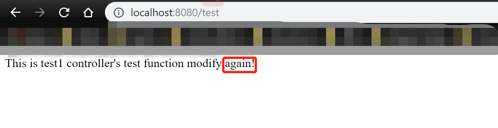

- 给个官网的关于自己配置JRebel的链接 [链接](http://manuals.zeroturnaround.com/jrebel/standalone/install.html)

## 总结

我们这个项目比较老，用的spring MVC框架，但是需要配置比较繁琐。所以上面的东西可能都已经没啥用了，本人也是初学者。目前应该都是使用Spring boot创建了，推荐一个在线创建项目的[网址](https://start.spring.io/)，很好用。Spring Boot 等再说了。本人真的是一点没学过java，有什么错误的地方望大神指出，好做学习。谢谢。